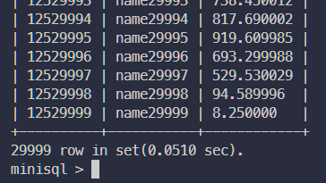
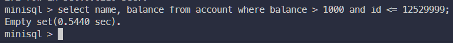
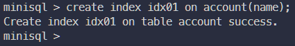

# MiniSQL

3210103722 章越

## 说明

本项目为单人实现，因此不区分小组总体设计报告和个人详细设计报告

## 任务目标

1. 设计并实现一个精简型单用户SQL引擎MiniSQL，允许用户通过字符界面输入SQL语句实现基本的增删改查操作，并能够通过索引来优化性能。
2. 通过对MiniSQL的设计与实现，提高学生的系统编程能力，加深对数据库管理系统底层设计的理解。

## 系统要求

1. 数据类型：要求支持三种基本数据类型：`integer`，`char(n)`，`float`。
2. 表定义：一个表可以定义多达32个属性，各属性可以指定是否为`unique`，支持单属性的主键定义。
3. 索引定义：对于表的主属性自动建立B+树索引，对于声明为`unique`的属性也需要建立B+树索引。
4. 数据操作: 可以通过`and`或`or`连接的多个条件进行查询，支持等值查询和区间查询。支持每次一条记录的插入操作；支持每次一条或多条记录的删除操作。
5. 在工程实现上，使用源代码管理工具（如Git）进行代码管理，代码提交历史和每次提交的信息清晰明确；同时编写的代码应符合代码规范，具有良好的代码风格。

## 实验环境

- WSL2 版本号1.2.5.0，子系统为Ubuntu 22.04.2 LTS
- gcc & g++ 11.3.0
- cmake 3.22.1
- gdb 12.1
- vscode 1.79.2
- git 2.34.1

## 模块设计

### Disk and Buffer Pool Manager

#### 位图页 Bitmap Page

位图页用于实现磁盘页的分配和回收工作，和正常的数据页一样占用`PAGE_SIZE`的空间，用于标记一段连续页的分配情况，具体实现函数如下：

- `bool BitmapPage<PageSize>::AllocatePage(uint32_t &page_offset)`

  用途：分配一个空闲页，并通过`page_offset`返回所分配的空闲页位于该段中的下标（从0开始）

  实现：根据存储的next_free_page_参数定位到下一个空闲页并返回该页信息，之后使用位运算更新位图页信息，再更新`next_free_page_`信息

- `bool BitmapPage<PageSize>::DeAllocatePage(uint32_t page_offset)`

  用途：回收指定页

  实现：如果该页未分配则返回`false`，否则使用位运算更新位图页信息，如有必要同时更新`next_free_page_`信息，返回true

- `bool BitmapPage<PageSize>::IsPageFree(uint32_t page_offset)`

  用途：返回指定页是否空闲

  实现：调用内部函数`IsPageFreeLow(page_offset / 8, page_offset % 8)`

- `bool IsPageFreeLow(uint32_t byte_index, uint8_t bit_index)`

  用途：检查指定位置的页是否空闲

  实现：利用位运算定位位图页信息，返回存储的空闲信息

#### 磁盘数据页管理 Disk Manager

把一个位图页加一段连续的数据页看做一个分区，再用Disk Manager进行维护，由于元数据和位图页需要占用数据页，因此需要再额外将物理页号转换为逻辑页号返回给上层，从而页分配对上层设计而言无感知。具体实现函数如下：

- `page_id_t DiskManager::AllocatePage()`

  用途：从磁盘中分配一个空闲页，并返回该页的逻辑页号

  实现：从磁盘元数据页中找到下一空闲分区，若无空闲分区则新建分区（创建位图页，更新磁盘元数据），然后在空闲分区中利用位图页的`AllocatePage`函数分配空闲页，并将该页物理页号转换为逻辑页号返回

- `void DiskManager::DeAllocatePage(page_id_t logical_page_id)`

  用途：释放指定逻辑页号对应的页

  实现：将逻辑页号转为物理页号，找到对应分区的对应位图页调用位图页的`DeAllocatePage`函数释放该页

- `bool DiskManager::IsPageFree(page_id_t logical_page_id)`

  用途：判断指定逻辑页是否空闲

  实现：将逻辑页号转为物理页号，找到该页对应的位图页，使用位图页的`IsPageFree`函数判断是否空闲

- `page_id_t DiskManager::MapPageId(page_id_t logical_page_id)`

  用途：将逻辑页号转为物理页号，为`DiskManager`类私有的辅助函数

  实现：根据逻辑页号和`BITMAP_SIZE`计算该页是第几个分区内的第几页，再转换成物理页号

#### LRU替换 LRU Replacer

在Buffer Pool没有空闲页时，需要决定剔除掉缓冲池内的哪一页以容纳新的页，此处为LRU替换的实现，具体实现函数如下：

- `bool LRUReplacer::Victim(frame_id_t *frame_id)`

  用途：删除与所有被跟踪的页想必最近最少使用的页帧号（即数据页在Buffer Pool的Page数组中的下标）存储在输出参数`frame_id`中输出并返回`true`，如果当前没有可以替换的元素则返回`false`

  实现：若`lru_list_`为空则返回`false`，否则删除`lru_list_`中第一个元素并存入`frame_id`，返回`true`

- `void LRUReplacer::Pin(frame_id_t frame_id)`

  用途：钉住指定数据页，不允许被替换

  实现：从`lru_list_`即lru替换列表中删除对应帧

- `void LRUReplacer::Unpin(frame_id_t frame_id)`

  用途：解除固定指定数据页，允许被替换

  实现：如果在`lru_list_`中不存在该页则尝试加入该页，若`lru_list_`已满则调用`Victim`函数删除一个页

- `size_t LRUReplacer::Size()`

  用途：返回当前可被替换的页的数量

  实现：返回`lru_list_`元素数量

#### Bonus： Clock Replacer

另一种替换算法，主要替换思路为遍历当前可被替换的页，找到第一个最近未被使用的页将其替换掉，若遍历到的页被标记为最近使用过则将其标记改为最近未使用，不断查找直至找到第一个最近未被使用的页，具体实现函数如下：

- `bool CLOCKReplacer::Victim(frame_id_t *frame_id)`

  用途：删除与所有被跟踪的页想必最近最少使用的页帧号（即数据页在Buffer Pool的Page数组中的下标）存储在输出参数`frame_id`中输出并返回`true`，如果当前没有可以替换的元素则返回`false`

  实现：若`clock_list`为空则返回false，否则循环查找`clock_list`，遇到`clock_status`为1的元素则将其置零，直到找到第一个`clock_status`为0的元素，将该页删除并返回`true`

- `void CLOCKReplacer::Pin(frame_id_t frame_id)`

  用途：钉住指定数据页，不允许被替换

  实现：从`clock_list`和`clock_status`中删除该页

- `void CLOCKReplacer::Unpin(frame_id_t frame_id)`

  用途：解除固定指定数据页，允许被替换

  实现：如果在`clock_list`中不存在该页则尝试加入该页，若`clock_list`已满则调用`Victim`函数删除一个页

- `size_t CLOCKReplacer::Size()`

  用途：返回当前可被替换的页的数量

  实现：返回`clock_list`元素数量

#### 缓冲池管理 Buffer Pool Manager

Buffer Pool Manager负责从Disk Manager中获取数据页并将它们存储在内存中，并在必要时将脏页面转储到磁盘中（如需要为新的页面腾出空间），具体实现函数如下：

- `frame_id_t BufferPoolManager::TryToFindFreePage()`

  用途：【自定义函数】用于找到一个空闲页

  实现：如果空闲列表中存在空闲页则返回第一个空闲页，否则使用`replacer`尝试替换一页，若被替换的页为脏页则写入磁盘，如果替换不到就返回`INVALID_PAGE_ID`

- `Page *BufferPoolManager::FetchPage(page_id_t page_id)`

  用途：根据逻辑页号从缓冲池内获取数据页，若不在缓冲池中则从硬盘中读取

  实现：如果在缓冲池内找到该页则钉住该页返回，若找不到则调用`TryToFindFreePage`函数尝试找到空闲页，若不存在空闲页则返回`nullptr`，否则读入该页存入缓冲池

- `Page *BufferPoolManager::NewPage(page_id_t &page_id)`

  用途：分配一个新的数据页，返回逻辑页号`page_id`和页指针

  实现：如果缓冲池已满且`replacer_`无法替换则返回`nullptr`，否则尝试找到一个空闲页，调用`DiskManager`的`AllocatePage`函数分配新页，设置初始属性后返回即可

- `bool BufferPoolManager::DeletePage(page_id_t page_id)`

  用途：释放指定数据页

  实现：如果找不到该页则直接返回`true`，若该页被固定无法释放则返回`false`，否则调用`DiskManager`的`DeAllocatePage`释放数据页，更新相关信息后返回`true`

- `bool BufferPoolManager::UnpinPage(page_id_t page_id, bool is_dirty)`

  用途：取消固定指定数据页

  实现：如果该页不存在或未被固定则返回`false`，否则调用`Replacer`的`Unpin`取消固定，并根据参数更新该页的`is_dirty`信息

- `bool BufferPoolManager::FlushPage(page_id_t page_id)`

  用途：将指定页转储至磁盘

  实现：如果该页不存在则返回`false`，若该页非脏页则返回`true`，调用`DiskManager`的`WritePage`函数转储至磁盘

### Record Manager

#### 序列化与反序列化

用于持久化记录Row、Field、Schema、Column对象，需要将这些对象序列化为字节流以写入数据页，与之相对的还需要实现反序列化方法，具体实现函数如下：

- `uint32_t Row::SerializeTo(char *buf, Schema *schema)`

  用途：序列化Row对象到buf中

  实现：首先检查schema是否为空以及schema的列数和当前row的fields数量是否一致，若通过检查则分别将列数、空位图、非空的fields信息序列化为字符串写入buf，返回写入数据量

- `uint32_t Row::DeserializeFrom(char *buf, Schema *schema)`

  用途：从buf中反序列化出Row对象

  实现：从buf中依次读出列数、空位图、非空的fields信息并存入当前Row对象中，返回读入数据量

- `uint32_t Row::GetSerializedSize(Schema *schema)`

  用途：获取序列化尺寸大小

  实现：返回列数大小（`uint32_t`）+空位图大小+非空列大小

- `uint32_t Column::SerializeTo(char *buf)`

  用途：序列化Column对象到buf中

  实现：依次将魔数`COLUMN_MAGIC_NUM`、列名、类型、长度、表内序号、是否可空、是否唯一这些列属性写入buf，返回写入数据量

- `uint32_t Column::DeserializeFrom(char *buf, Column *&column)`

  用途：从buf中反序列化出Column对象

  实现：从buf中依次读出魔数、列名、类型、长度、表内序号、是否可空、是否唯一这些属性，并构造新Column对象通过column参数返回，若魔数不匹配则抛出异常，返回读入数据量

- `uint32_t Column::GetSerializedSize()`

  用途：获取序列化尺寸大小

  实现：返回`uint32_t`*7+列名长度

- `uint32_t Schema::SerializeTo(char *buf)`

  用途：序列化Schema对象到buf中

  实现：依次将魔数、列数、每列数据、`is_manage_`属性写入buf，返回写入数据量

- `uint32_t Schema::DeserializeFrom(char *buf, Schema *&schema)`

  用途：从buf中反序列化出Schema对象

  实现：从buf中依次读出魔数、列数、每列数据、`is_manage_`属性，构造新Schema对象通过schema参数返回，若魔数不匹配则抛出异常，返回读入数据量

- `uint32_t Schema::GetSerializedSize()`

  用途：获取序列化尺寸大小

  实现：返回`uint32_t`*2+每一列的`SerializedSize`

#### 堆表 Table Heap

堆表是一种将记录以无序堆的形式进行组织的数据结构，项目中为分槽页结构。


具体实现函数如下：

- `bool TableHeap::InsertTuple(Row &row, Transaction *txn)`

  用途：向堆表中插入一条记录，插入记录后生成的RowId需要通过row对象返回

  实现：使用`BufferPoolManager`的`FetchPage`函数获取数据页，再使用`TablePage`的`InsertTuple`函数插入记录。如果没有页可以容纳这一记录则新建一页

- `bool TableHeap::UpdateTuple(const Row &row, const RowId &rid, Transaction *txn)`

  用途：将RowId为rid的记录`old_row`替换成新的记录`new_row`，并将new_row的RowId通过`row.rid_`返回

  实现：获取旧的Row对象，调用`TablePage`的`UpdateTuple`函数更新记录，如果更新失败且原因为空间不足，则删除原有记录并插入新的记录，返回结果

- `void TableHeap::ApplyDelete(const RowId &rid, Transaction *txn)`

  用途：真正删除标记删除的记录

  实现：获取相应的TablePage对象，调用`ApplyDelete`函数删除记录

- `bool TableHeap::GetTuple(Row *row, Transaction *txn)`

  用途：获取RowId为`row->rid_`的记录

  实现：获取TablePage对象，调用`GetTuple`函数获取记录

- `void FreeTableHeap()`

  用途：销毁TableHeap并释放数据页

  实现：遍历堆表中所有数据页，执行Unpin和DeletePage操作

- `TableIterator TableHeap::Begin(Transaction *txn)`

  用途：返回堆表首迭代器

  实现：构造堆表首对应的TableIterator对象

- `TableIterator TableHeap::End()`

  用途：返回堆表尾迭代器

  实现：构造堆表尾对应的TableIterator对象

- `TableIterator::TableIterator(bool mode, page_id_t first_page_id, Schema *schema, BufferPoolManager *buffer_pool_manager, Transaction *txn, LogManager *log_manager, LockManager *lock_manager)`

  用途：表迭代器构造函数

  实现：mode为假表示首迭代器，mode为真表示尾迭代器，根据输入的参数初始化相应属性，若表为空则设置为尾迭代器

- `TableIterator &TableIterator::operator++()`

  用途：移动到下一条记录，为自加运算符的重载(++iter)

  实现：调用`TablePage`的`GetNextTupleRid`函数获取下一条记录，若获取不到则调用`GetNextPageId`函数获取下一页的首条记录

- `TableIterator TableIterator::operator++(int)`

  同样为自加运算符的重载(iter++)，与上一条基本相同，只有返回内容的差异

其它`TableIterator`中过于简单的函数略去不表。

### Index Manager

#### B+树数据页 B Plus Tree Page

B+树数据页包含`BPlusTreePage`公共父类和`BPlusTreeInternalPage`、`BPlusTreeLeafPage`中间结点和叶结点两个子类，具体实现函数如下：

由于相关函数过多，以下仅列出较为重要和较为复杂的函数

BPlusTreePage类中主要为一些简单的Get/Set方法，略去不表

##### 中间结点数据页 BPlussTreeInternalPage

- `page_id_t InternalPage::Lookup(const GenericKey *key, const KeyManager &KM)`

  用途：二分查找，返回给定key所在的子结点

  实现：从下标为1的key开始二分查找（下标为0的是INVALID_KEY，不存储内容），注意返回时要判断是否越界，避免段错误

- `int InternalPage::InsertNodeAfter(const page_id_t &old_value, GenericKey *new_key, const page_id_t &new_value)`

  用途：在指定value之后插入新的键值对

  实现：利用`ValueIndex`函数找到指定的value对应的位置，再将之后所有键值对向后移动`pair_size`，插入新的键值对

- `void InternalPage::MoveHalfTo(InternalPage *recipient, BufferPoolManager *buffer_pool_manager)`

  用途：把该对象一半的键值对转移至recipient对象

  实现：利用`CopyNFrom`函数把后一半的键值对复制至recipient对象，再更新size等属性

- `void InternalPage::CopyNFrom(void *src, int size, BufferPoolManager *buffer_pool_manager)`

  用途：从src中复制size个数据对到当前对象

  实现：使用memcpy复制键值对，再遍历键值对中指向的每一个子结点，更新其父结点信息

- `void InternalPage::MoveAllTo(InternalPage *recipient, GenericKey *middle_key, BufferPoolManager *buffer_pool_manager)`

  用途：把当前页所有键值对移动至recipient对象，`middle_key`表示二者之间边界的key值

  实现：将当前结点下标为0的key设为`middle_key`，调用recipient的`CopyNFrom`函数将当前结点所有键值对复制到recipient中，再找到父结点后调用父结点的`Remove`函数移除当前结点入口

- `void InternalPage::MoveFirstToEndOf(InternalPage *recipient, GenericKey *middle_key, BufferPoolManager *buffer_pool_manager)`

  用途：把当前结点第一个键值对移到recipient的末尾

  实现：更新当前结点第一个键值对对应的子结点的父结点信息，把该键值对的键值设为`middle_key`，再调用recipient的`CopyLastFrom`函数把键值对移动过去

- `void InternalPage::MoveLastToFrontOf(InternalPage *recipient, GenericKey *middle_key, BufferPoolManager *buffer_pool_manager)`

  用途：把当前结点的最后一个键值对移到recipient的最前面

  实现：类似上一个函数，更新当前结点最后一个键值对对应的子结点的父结点信息，更改父结点中指向recipient的键值，调用recipient的`CopyFirstFrom`函数把键值对移动过去，再将当前recipient的第二个键值对的键值（由于这个键值对在移动之前是第一个键值对，因此键值为INVALID_KEY）更改为`middle_key`

##### 叶结点数据页 BPlusTreeLeafPage

大多数方法与中间结点类类似，在实现细节上存在些许差异

- `int LeafPage::KeyIndex(const GenericKey *key, const KeyManager &KM)`

  用途：二分查找第一个键值$\geq$给定key的位置

  实现：利用`KM.ComareKeys`进行键值比较，其它为常规的二分查找

- `int LeafPage::Insert(GenericKey *key, const RowId &value, const KeyManager &KM)`

  用途：插入指定键值对

  实现：判断是否重复，若重复则直接返回页大小，否则将比该键值对大的键值对向后移动，插入新的键值对后返回新的页大小

#### B+树索引 B Plus Tree

在B+树结点的结构设计的基础上，进一步实现B+树的上层操作（创建、插入、查找等），具体实现函数如下：

- `bool BPlusTree::GetValue(const GenericKey *key, std::vector<RowId> &result, Transaction *transaction)`

  用途：根据给定key查找值

  实现：先用`FindLeafPage`函数找到对应的叶结点，再用叶结点的`Lookup`函数查找键值

- `void BPlusTree::StartNewTree(GenericKey *key, const RowId &value)`

  用途：把键值对插入至空树

  实现：为根节点分配页，更新根节点页信息，插入并初始化第一个结点

- `bool BPlusTree::InsertIntoLeaf(GenericKey *key, const RowId &value, Transaction *transaction)`

  用途：把键值对插入至叶结点

  实现：先用`FindLeafPage`函数找到对应的叶结点，若键值对不存在于叶结点则调用叶结点的`Insert`函数插入键值对，然后判断叶结点大小是否超出限制，若是则进行Split分裂结点

- `BPlusTreeInternalPage *BPlusTree::Split(InternalPage *node, Transaction *transaction)`和`BPlusTreeLeafPage *BPlusTree::Split(LeafPage *node, Transaction *transaction)`

  用途：分裂结点，返回新产生的结点

  实现：为新结点分配空间，调用老结点的`MoveHalfTo`函数将老结点的一半键值对移到新结点

- `void BPlusTree::InsertIntoParent(BPlusTreePage *old_node, GenericKey *key, BPlusTreePage *new_node, Transaction *transaction)`

  用途：分裂后将键值对插入至父结点中（即更新索引信息）

  实现：如果老结点为根节点，则分配新的根节点（`PopulateNewRoot`、`UpdateRootPageId`等函数），否则取回父结点，将新的键值对插入至父结点中，若父结点大小超限则递归调用`Split`和`InsertIntoParent`进一步分裂

- `void BPlusTree::Remove(const GenericKey *key, Transaction *transaction)`

  用途：从B+树中移除指定键值对

  实现：先用`FindLeafPage`函数找到对应的叶结点，调用叶结点的`RemoveAndDeleteRecord`函数删除记录，若该记录存在父结点的索引中则更新父结点的键值对存储的信息（不一定是叶结点的父亲，此处会一直找到根节点判断是否需要更新），若删除完成后叶结点大小低于下限则调用`CoalesceOrRedistribute`函数进行合并

- `template <typename N> bool BPlusTree::CoalesceOrRedistribute(N *&node, Transaction *transaction)`

  用途：用于处理当前结点尺寸过小的情况，若兄弟结点大小+当前结点大小大于上限则执行redistribute否则执行merge，返回值表示目标叶结点是否被删除

  实现：首先根据当前结点父结点信息找到兄弟结点（若当前结点是第一个孩子则兄弟结点为右兄弟，否则为左兄弟），再判断当前结点大小+兄弟结点大小是否超限，若超限则调用`Redistribute`函数（重新分配不需要删除当前结点，返回`false`）否则调用`Coalesce`函数（把当前结点合并至兄弟结点需要删除当前结点，返回`true`）进行合并

- `bool BPlusTree::Coalesce(LeafPage *&neighbor_node, LeafPage *&node, InternalPage *&parent, int index, Transaction *transaction)`和`bool BPlusTree::Coalesce(InternalPage *&neighbor_node, InternalPage *&node, InternalPage *&parent, int index, Transaction *transaction)`

  用途：把当前结点所有键值对移动至兄弟结点，删除当前结点的数据页

  实现：调用当前结点的`MoveAllTo`函数把所有键值对移动到兄弟结点，再从父结点中移除当前结点入口，此时需要再判断父结点大小是否低于下限，若是则需要递归调用`CoalesceOrRedistribute`函数进行合并

- `void BPlusTree::Redistribute(LeafPage *neighbor_node, LeafPage *node, int index)`和`void BPlusTree::Redistribute(InternalPage *neighbor_node, InternalPage *node, int index)`

  用途：重新分配当前结点和兄弟结点的键值对，若index=0则把兄弟结点的第一个键值对移动到当前结点的最后，否则把兄弟结点的最后一个键值对移动到当前结点的最前面

  实现：在参数为`InternalPage`的函数中，需要额外获取父结点来查找`middle_key`信息（`middle_key`的值为合并的两个结点的后一个结点最前面的value对应的key，这个key值存在父结点指向该结点的入口处），在此之后两个函数都是根据index的值分别调用`MoveFirstToEndOf`和`MoveLastToFrontOf`两个函数移动键值对，同时更新父结点对应的入口

- `bool BPlusTree::AdjustRoot(BPlusTreePage *old_root_node)`

  用途：更新根结点页（在调整根节点时需要调用此函数判断）

  实现：当根结点页中最后一个元素被删除时，把根节点唯一的孩子当做新的根结点；当根结点为叶结点且被删除时，删除整个B+树

- `IndexIterator BPlusTree::Begin(const GenericKey *key)`

  用途：返回key对应的结点迭代器

  实现：调用`FindLeafPage`函数找到key对应的叶结点，若找不到则返回End迭代器，否则构造该页的迭代器

  另外两个迭代器(Begin、End)都差不多

- `Page *BPlusTree::FindLeafPage(const GenericKey *key, page_id_t page_id, bool leftMost)`

  用途：根据key值找到对应的叶结点，若leftMost为真则找到最左边的叶结点

  实现：从给定`page_id`开始，根据leftMost的值分别查找key值的下一层结点或最左侧结点，重复直至该结点为叶结点并返回

#### B+树索引迭代器 Index Iterator

该迭代器将所有叶结点组织起来进行遍历，和TableHeap对应的迭代器类似

此处只列出++运算的重载

- `IndexIterator &IndexIterator::operator++()`

  用途：返回下一迭代器，重载自增运算

  实现：如果当前页还有下一元素则返回该元素，否则取出下一页返回第一个元素

### Catalog Manager

#### 目录元信息

数据库中定义的表和索引分别存储于`TableInfo`和`IndexInfo`对象中，还有一个管理表和索引的元信息的存储类`CatalogMeta`，需要实现这些类的序列化和反序列化操作以实现持久化存储

该部分的序列化和反序列化操作和前述的Record Manager部分的Row、Column、Schema等对象的序列化和反序列化的操作高度类似，且实现难度不大，就是把相应的属性转换为字符串进行存储，在此不过多展开赘述

#### 表和索引的管理 Catalog Manager

用于管理表和索引信息，为上层提供相关管理方法，具体实现函数如下：

- `CatalogManager::CatalogManager(BufferPoolManager *buffer_pool_manager, LockManager *lock_manager, LogManager *log_manager, bool init)`

  用途：构造函数，用于初始化

  实现：若init为真则创建新的CatalogMeta实例，否则读取目录页的信息初始化catalog对象

- `dberr_t CatalogManager::CreateTable(const string &table_name, TableSchema *schema, Transaction *txn, TableInfo *&table_info)`

  用途：创建新表

  实现：首先查找是否存在同名表，若存在则返回`DB_TABLE_ALREADY_EXIST`，不存在该表则先创建表元数据页（table_meta_page），再创建`TableHeap`、`TableMeta`等对象并初始化（注意从schema生成新的TableSchema时需要深拷贝），最后更新目录的元数据

- `dberr_t CatalogManager::GetTable(const string &table_name, TableInfo *&table_info)`

  用途：获取指定表名的表信息

  实现：在catalog中存储的`tables_names_`中查找表并返回

- `dberr_t CatalogManager::GetTables(vector<TableInfo *> &tables)`

  用途：获取所有表

  实现：返回catalog中存储的tables里存储的所有表名

- `dberr_t CatalogManager::CreateIndex(const std::string &table_name, const string &index_name, const std::vector<std::string> &index_keys, Transaction *txn, IndexInfo *&index_info, const string &index_type)`

  用途：创建新索引

  实现：首先检查表名是否存在、索引名是否存在、新索引中所有列名是否存在，检查通过后创建索引元数据页（index_meta_page），再创建`IndexMeta`、`IndexInfo`等对象并初始化，最后更新目录的元数据

- `dberr_t CatalogManager::GetIndex(const std::string &table_name, const std::string &index_name, IndexInfo *&index_info)`

  用途：获取索引

  实现：先检查表名是否存在，再在该表对应的索引中查询指定索引并返回

- `dberr_t CatalogManager::GetTableIndexes(const std::string &table_name, std::vector<IndexInfo *> &indexes)`

  用途：获取指定表的所有索引

  实现：先检查表名是否存在，再根据catalog中存储的index信息返回该表对应的所有索引

- `dberr_t CatalogManager::DropTable(const string &table_name)`

  用途：删除指定表

  实现：检查指定表名是否存在，删除该表对应的所有索引（调用`DropIndex`函数），最后在catalog、table等对象中删除该表

- `dberr_t CatalogManager::DropIndex(const string &table_name, const string &index_name)`

  用途：删除指定索引

  实现：检查指定表名、索引名是否存在，然后在catalog、index等对象中删除该索引

- `dberr_t CatalogManager::FlushCatalogMetaPage()`

  用途：转储目录元数据页

  实现：调用`BufferPoolManager`的`FlushPage`函数转储ID为`CATALOG_META_PAGE_ID`的元数据页

- `dberr_t CatalogManager::LoadTable(const table_id_t table_id, const page_id_t page_id)`

  用途：读取表格

  实现：从指定page中读取数据反序列化为table对象

- `dberr_t CatalogManager::LoadIndex(const index_id_t index_id, const page_id_t page_id)`

  用途：读取索引

  实现：从指定page中读取数据反序列化为index对象，注意这里需要首先读取表名，找到该表后再建立表和索引的对应关系并存储至catalog对象中

### Planner and Executor

#### 执行器 Executor

执行器根据parser解析器生成的语法树和planner生成的计划来执行相关任务，具体实现函数如下

##### 线性扫描执行器 SeqScanExecutor

- `void SeqScanExecutor::Init()`

  用途：初始化执行器

  实现：从计划中获取table、schema等数据并初始化SeqScanExecutor对象

- `bool SeqScanExecutor::Next(Row *row, RowId *rid)`

  用途：获取下一条扫描结果

  实现：若当前table迭代器已到达end迭代器（即完成表格扫描）则返回false，否则若查询计划中没有谓词则返回迭代器指向的记录并使迭代器自增，若查询计划中有谓词则不断自增迭代器直至找到第一条满足谓词的记录（判断是否满足谓词使用`plan_->GetPredicate()->Evaluate(row).CompareEquals(Field(kTypeInt, 1))`，即调用`AbstractExpression`类的`Evaluate`进行比较，由于底层没有布尔类型，因此需要将结果和1进行比较）

##### 索引扫描执行器 IndexScanExecutor

- `void IndexScanExecutor::Init()`

  用途：初始化执行器

  实现：从计划中获取相关数据初始化IndexScanExecutor对象，同时从语法树中获取查询谓词，利用`Index`的`ScanKey`函数获取所有满足条件的记录，存储所有有索引的谓词中满足条件的记录的交集并存储在IndexScanExecutor对象中

- `bool IndexScanExecutor::Next(Row *row, RowId *rid)`

  用途：获取下一条扫描结果

  实现：根据初始化时维护的满足所有有索引的谓词的记录中找到下一条同时满足所有谓词的记录并返回（如果所有谓词都有索引那么直接返回存储的下一条记录）

##### 插入执行器 InsertExecutor

- `void InsertExecutor::Init()`

  用途：初始化执行器

  实现：从计划中获取相关数据初始化InsertExecutor对象，同时记录下schema中所有unique的列

- `bool InsertExecutor::Next([[maybe_unused]] Row *row, RowId *rid)`

  用途：执行下一条插入计划

  实现：获取插入计划的下一条插入的记录，首先检查该记录所有unique的列是否存在和已有记录的重复（此处为加速使用索引扫描），然后调用`TableHeap`的`InsertTuple`函数插入记录，同时在该表所有索引中也插入该条记录

##### 更新执行器 UpdateExecutor

- `void UpdateExecutor::Init()`

  用途：初始化执行器

  实现：从计划中获取相关数据初始化UpdateExecutor对象

- `bool UpdateExecutor::Next([[maybe_unused]] Row *row, RowId *rid)`

  用途：执行下一条更新计划

  实现：从计划中获取要更改的原始行和更新后的记录，调用`TableHeap`的`UpdateTuple`函数更新记录，再更新该表所有索引中的数据

##### 删除执行器 DeleteExecutor

- `void DeleteExecutor::Init()`

  用途：初始化执行器

  实现：从计划中获取相关数据初始化DeleteExecutor对象

- `bool DeleteExecutor::Next([[maybe_unused]] Row *row, RowId *rid)`

  用途：执行下一条删除计划

  实现：从计划中获取要删除的记录，调用`TableHeap`的`MarkDelete`函数标记删除，再从该表对应的所有索引中删除该记录

##### 执行引擎 ExecuteEngine

其它语法树较为简单的指令不需要生成计划，可直接根据语法树执行

- `dberr_t ExecuteEngine::ExecuteCreateDatabase(pSyntaxNode ast, ExecuteContext *context)`

  用途：创建数据库

  实现：检查该数据库名是否存在，创建新的`DBStorageEngine`对象

- `dberr_t ExecuteEngine::ExecuteDropDatabase(pSyntaxNode ast, ExecuteContext *context)`

  用途：删除数据库

  实现：检查该数据库名是否存在，从`dbs_`列表中删除该数据库，并调用`remove`函数删除数据库文件

- `dberr_t ExecuteEngine::ExecuteShowDatabases(pSyntaxNode ast, ExecuteContext *context)`

  用途：显示所有数据库

  实现：获取`dbs_`列表中所有数据库名，比较得出最大名称长度之后格式化输出

- `dberr_t ExecuteEngine::ExecuteUseDatabase(pSyntaxNode ast, ExecuteContext *context)`

  用途：使用指定数据库

  实现：检查该数据库名是否存在，修改`current_db_`变量为指定数据库名

- `dberr_t ExecuteEngine::ExecuteShowTables(pSyntaxNode ast, ExecuteContext *context)`

  用途：显示所有表格

  实现：检查是否选择数据库、数据库、表名是否存在，获取当前数据库所有表名，得出最大名称长度后格式化输出

- `dberr_t ExecuteEngine::ExecuteCreateTable(pSyntaxNode ast, ExecuteContext *context)`

  用途：创建表格

  实现：检查是否选择数据库、数据库、表名是否存在，从语法树中获取表格schema（包括列名、主键、约束等），根据schema调用`CatalogManager`的`CreateTable`函数创建表，再对所有primary key和unique的列创建索引（调用`CatalogManager`的`CreateIndex`函数）

- `dberr_t ExecuteEngine::ExecuteDropTable(pSyntaxNode ast, ExecuteContext *context)`

  用途：删除表格

  实现：检查是否选择数据库、数据库是否存在，调用`CatalogManager`的`DropTable`函数删除表格

- `dberr_t ExecuteEngine::ExecuteShowIndexes(pSyntaxNode ast, ExecuteContext *context)`

  用途：显示所有索引

  实现：检查是否选择数据库、数据库是否存在，遍历数据库内每一张表获取表对应的索引，再根据输出字符串长度格式化输出

- `dberr_t ExecuteEngine::ExecuteCreateIndex(pSyntaxNode ast, ExecuteContext *context)`

  用途：创建索引

  实现：检查是否选择数据库、数据库是否存在，根据语法树获取需要建立的索引的列名，调用`CatalogManager`的`CreateIndex`函数创建索引，再将当前表中所有记录插入至索引中

- `dberr_t ExecuteEngine::ExecuteDropIndex(pSyntaxNode ast, ExecuteContext *context)`

  用途：删除索引

  实现：检查是否选择数据库、数据库、表名是否存在，调用`CatalogManager`的`DropIndex`函数删除索引

- `dberr_t ExecuteEngine::ExecuteExecfile(pSyntaxNode ast, ExecuteContext *context)`

  用途：执行文件中的SQL语句

  实现：读入文件并开始计时，逐字符扫描文件（跳过`\n、\r`字符），遇到分号则将当前语句传入yyparse解析（调用`yy_scan_string`、`yy_switch_to_buffer`、`MinisqlParserInit`、`yyparse`等一系列函数），再对解析出的语法树执行`Execute`函数执行该语句，执行完成后释放解析器，循环直至读完文件，结束计时输出执行总用时

- `dberr_t ExecuteEngine::ExecuteQuit(pSyntaxNode ast, ExecuteContext *context)`

  用途：退出程序

  实现：返回`DB_QUIT`状态码

## 系统测试

### 正确性测试

除框架中提供的测试外，还新增了部分测试点，例如：

- 针对Clock Replacer的测试
- 针对Row、Column、Schema的序列化和反序列化测试

以Clock Replacer的测试设计为例（代码如下图），此测试模块的设计与LRU Replacer的测试类似，用于验证Clock Replacer功能的正确性


系统通过所有24个测试点（包括框架内的测试点和后续自行添加的测试点）


注：此处的测试耗时集中在DiskManagerTest中，这是因为该测试进行了大量的磁盘分配和释放行为（约`BITMAP_SIZE * extent_nums`$\approx 2^{16}$），属于比较极端的测试，耗时较长（3.5秒）是正常现象

### 功能性测试

按照验收流程依次执行以下功能性测试SQL代码，每个account.txt文件中包含10000条记录

所有要求的功能均能正常实现，满足要求

#### 创建数据库

```sql
create database db0;
create database db1;
create database db2;
show databases;
use db0;
```


#### 创建表

```sql
create table account(
  id int, 
  name char(16), 
  balance float, 
  primary key(id)
);
```


#### 插入三万条记录

```sql
execfile "../../sql_gen/account00.txt";
execfile "../../sql_gen/account01.txt";
execfile "../../sql_gen/account02.txt";
```


#### select测试

```sql
select * from account;
```


```sql
select * from account where id = 12502345;
select * from account where balance = 181.259995;
select * from account where name = "name26789";
select * from account where id <> 12509999;
select * from account where balance <> 86.269997;
select * from account where name <> "name09999";
```




#### 多条件select测试

```sql
select id, name from account where balance >= 990 and balance < 3000;
select name, balance from account where balance > 1000 and id <= 12529999;
select * from account where id < 12515000 and name > "name14500";
select * from account where id < 12500200 and name < "name00100";
```





#### 插入主键重复值测试

```sql
insert into account values(12509999,"name99999",8.1);
```

提示由于id重复，插入失败


#### 创建索引

```sql
create index idx01 on account(name);
```



#### 索引select

```sql
select * from account where name = "name26789";
```

注意到现在查询速度（0.0000sec）相较于前面没创建索引时的查询速度（0.0200sec）快了很多


```sql
select * from account where name = "name45678";
select * from account where id < 12500200 and name < "name00100";
```


#### 索引删除记录

```sql
delete from account where name = "name25678";
```


#### 索引插入记录

```sql
insert into account values(12525678, "name25678", 880.67);
```


#### 删除索引

```sql
drop index idx01;
```


#### 更新记录

```sql
update account set id =12529999 where name = "name29999";
```


#### 删除记录

```sql
delete from account where balance = 123123.123;
```

该记录不存在


```sql
delete from account;
```


#### 删除表

```sql
drop table account;
```


#### 删除数据库

```sql
drop database db0;
```


## 编译说明

基本构建命令

```bash
mkdir build
cd build
cmake -DCMAKE_BUILD_TYPE=Release ..
make -j
```

构建完成后运行build/test/minisql_test将执行所有测试，运行build/bin/main将执行主程序

## 项目回顾&个人总结

该项目涉及到的知识点较多，需要实现许多非常底层的功能，对我而言确实是一个较大的挑战。由于时间有限，单人完成该项目工作量非常大，因此该项目在性能方面略有不足，数据量提升之后运行速度会明显下降，该项目在性能方面有待进一步优化。

在该项目的实现过程中，也进一步锻炼了我的工程管理和开发能力，对于数据库管理系统有了更深一步的认识和了解，代码编写、调试能力也进一步提升（不得不说B+树那一块真的花了很长时间进行调试）。

整个项目使用Git进行版本控制，代码提交信息较为规范，以下为部分提交记录的截图（注：该代码仓库为私有库，仅供个人开发管理使用，不违反诚信守则）


历经约80小时的编码和调试时间，该项目主体部分均已完成，但bonus仅完成了最为简单的Clock Replacer，其它更为复杂的bonus并没有实现。目前项目已达到预期，能够正确处理规定的指令，且程序运行时间尚在可接受的范围中，虽稍有瑕疵但整体而言完成度较高，个人感觉较为满意。
